# 🥗 NutriFit

Sistema web de acompanhamento nutricional e treinos personalizados, desenvolvido como trabalho prático da disciplina de Programação Orientada a Objetos Avançada.

---

## 📋 Descrição do sistema

O NutriFit simula uma plataforma de uma empresa de acompanhamento nutricional e treinos personalizados. O sistema possui dois perfis de acesso:

- **Administrador**: gerencia o cadastro de usuários, metas, refeições, treinos e agendamentos, através de um dashboard com indicadores gerais (totais cadastrados de cada entidade).
- **Usuário**: acompanha seus próprios dados em um dashboard pessoal, com cálculo automático de IMC, classificação do IMC, percentual de calorias consumidas em relação à meta diária (com barra de progresso colorida) e uma recomendação automática gerada com base no consumo registrado.

A aplicação foi construída em camadas (`controller` → `service` → `repository` → `model`), com autenticação simples via sessão HTTP e controle de acesso por perfil (`ADMIN` / `USUARIO`).

---

## 👥 Integrantes do grupo

- Otávio Henrique de Oliveira Silva

---

## 🛠️ Tecnologias utilizadas

### Backend
- **Java 17**
- **Spring Boot 3.5**
- **Spring MVC** (controllers web)
- **Spring Data JPA** (persistência)
- **Bean Validation / Jakarta Validation** (validações de backend)
- **Lombok** (redução de boilerplate em getters/setters)
- **Maven** (gerenciamento de dependências e build)

### Frontend
- **Thymeleaf** (templates server-side)
- **HTML5 / CSS3**
- **Bootstrap 5** (estilização e responsividade)

### Banco de dados
- **MySQL** (banco principal)
- **H2 Database** (banco em memória, usado nos testes automatizados e como perfil alternativo de execução)

### Controle de versão
- **Git / GitLab**

---

## 🗂️ Organização do projeto

O projeto segue a arquitetura em camadas:

```
src/main/java/br/com/nutrifit/
├── config/       → inicialização de dados (usuário admin padrão)
├── controller/   → camada web (recebe requisições, delega para os services)
├── service/      → regras de negócio (IMC, cálculo calórico, CRUDs)
├── repository/   → interfaces Spring Data JPA
├── model/        → entidades JPA, superclasse Pessoa e enums
└── dto/          → não utilizado (opcional conforme o enunciado)

src/main/resources/
├── templates/    → páginas Thymeleaf, organizadas por entidade
├── static/css/   → estilos customizados
└── application*.properties → configurações de banco (MySQL / H2)
```

---

## ▶️ Instruções de execução

### Pré-requisitos

- JDK 17 ou superior
- Maven (ou usar o `mvnw` incluso no projeto)
- MySQL em execução local (somente para o perfil padrão)

### Opção 1 — Executando com MySQL (perfil padrão)

1. Crie o banco de dados:

```sql
CREATE DATABASE nutrifit;
```

2. Configure usuário e senha em `src/main/resources/application.properties`:

```properties
spring.datasource.username=seu_usuario
spring.datasource.password=sua_senha
```

3. Execute:

```bash
./mvnw spring-boot:run
```

4. Acesse `http://localhost:8080`

### Opção 2 — Executando com H2 (sem MySQL)

Para facilitar a execução do projeto, também é possível utilizar o banco de dados H2 em memória, dispensando a instalação e configuração do MySQL.

No PowerShell, execute:

```bash
$env:SPRING_PROFILES_ACTIVE="h2"
./mvnw spring-boot:run
```

Após iniciar a aplicação:

- Sistema: http://localhost:8080
- Console do H2: http://localhost:8080/h2-console

Configurações do console H2:

- JDBC URL: `jdbc:h2:mem:nutrifit`
- Usuário: `sa`
- Senha: *(em branco)*

### Login inicial

Ao iniciar a aplicação pela primeira vez, um usuário administrador é criado automaticamente pela classe `DataInitializer`:

| Campo | Valor              |
|-------|--------------------|
| Email | admin@nutrifit.com |
| Senha | 123456             |

A partir dele, novos usuários com perfil `USUARIO` podem ser cadastrados pela tela de gerenciamento.

### Testes automatizados

```bash
./mvnw test
```

Os testes rodam contra um banco H2 em memória isolado, sem afetar o banco MySQL.

---

## ✅ Funcionalidades implementadas

### Autenticação e acesso
- Login com sessão HTTP
- Controle de acesso por perfil (`ADMIN` / `USUARIO`)
- Logout com invalidação de sessão

### Dashboard
- Dashboard administrativo com totais de usuários, metas, refeições, treinos e agendamentos
- Dashboard do usuário com dados pessoais, IMC, progresso calórico e recomendações

### Usuários
- CRUD completo (cadastro, listagem, edição, exclusão)
- Campos: nome, e-mail, senha, peso, altura, meta calórica, perfil e objetivo nutricional

### Refeições
- CRUD completo vinculado ao usuário
- Tipos: Café da manhã, Almoço, Jantar e Lanche
- Controle de calorias por refeição

### Treinos
- CRUD completo vinculado ao usuário
- Campos: nome, descrição e duração (em minutos)

### Agendamentos
- CRUD completo vinculado ao usuário
- Campos: data, horário e status (Pendente / Confirmado / Cancelado)

### Metas
- CRUD completo com relacionamento 1:1 com o usuário
- Campos: descrição e peso objetivo

### Telas do usuário
- Minhas Refeições
- Meus Treinos
- Meus Agendamentos
- Minha Meta

---

## ⭐ Funcionalidade extra escolhida

**Painel inteligente de acompanhamento nutricional — cálculo de IMC e progresso calórico com recomendação automática.**

A cada acesso ao dashboard, o sistema calcula automaticamente:

- **IMC** a partir do peso e altura cadastrados, com classificação (Abaixo do peso, Peso normal, Sobrepeso, Obesidade Graus I, II e III) e mensagem contextual;
- **Total de calorias consumidas**, somando todas as refeições registradas pelo usuário;
- **Percentual da meta calórica diária**, exibido em uma barra de progresso que muda de cor conforme o consumo:
  - 🟢 Verde: até 80% da meta
  - 🟡 Amarelo: entre 80% e 100%
  - 🔴 Vermelho: acima da meta
- **Recomendação textual automática**, gerada por regras de negócio (ex.: *"Você está próximo de atingir sua meta"*, *"Consumo calórico acima da meta diária"*).

Toda essa lógica está isolada nos services `IMCService` e `NutricaoService`, sem regras de negócio nos controllers, demonstrando a separação de responsabilidades da arquitetura em camadas.

---

## 🔗 Relacionamentos entre entidades

```
Pessoa (MappedSuperclass)
   └── Usuario

Usuário (1) ──── (1) Meta

Usuário (1) ──── (N) Refeições

Usuário (1) ──── (N) Treinos

Usuário (1) ──── (N) Agendamentos
```

---

## 💡 Conceitos de OO aplicados

- **Herança**: `Usuario` estende a superclasse mapeada `Pessoa` (`@MappedSuperclass`)
- **Encapsulamento**: atributos privados com getters/setters via Lombok
- **Separação de responsabilidades**: controllers não contêm regras de negócio
- **Injeção de dependência**: via construtor (padrão Spring)
- **Persistência com JPA**: mapeamento objeto-relacional com anotações
- **Relacionamentos entre entidades**: `@OneToOne`, `@OneToMany`, `@ManyToOne`

---

## 📚 Boas práticas aplicadas

- Arquitetura em camadas
- Separação de responsabilidades
- Injeção de dependência
- Reutilização de código através de Services
- Utilização de Fragments do Thymeleaf para reaproveitamento de layout
- Persistência utilizando Spring Data JPA
- Validações no backend e frontend

---

## 📸 Prints do sistema

### Tela de login
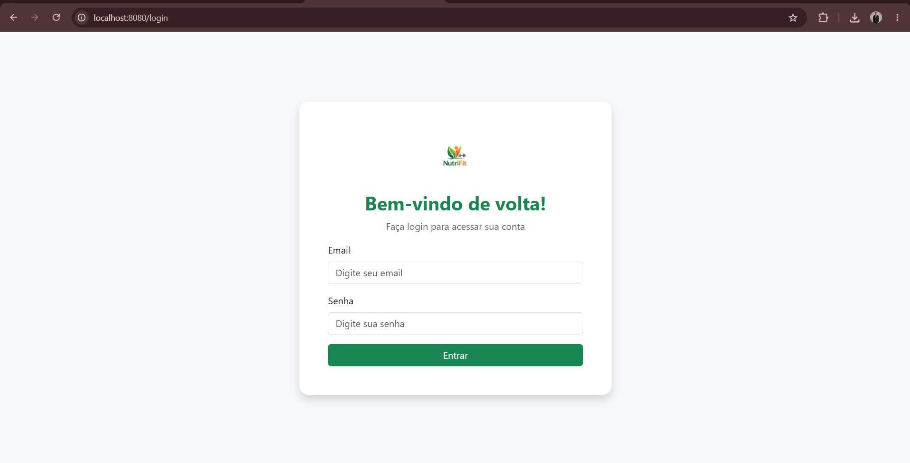

### Dashboard administrativo
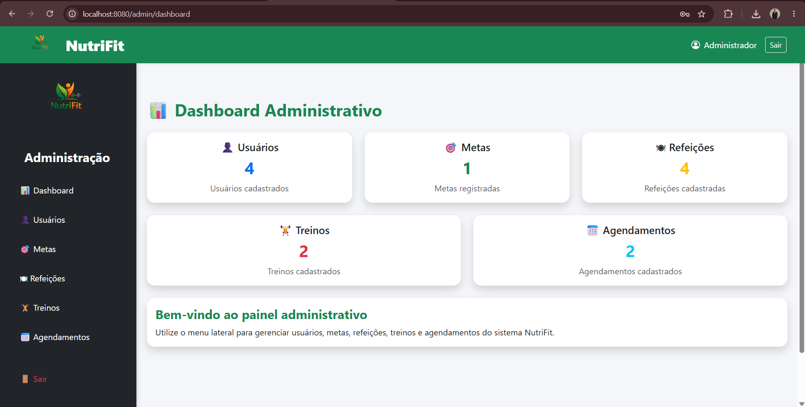

### Dashboard do usuário (IMC e progresso calórico)
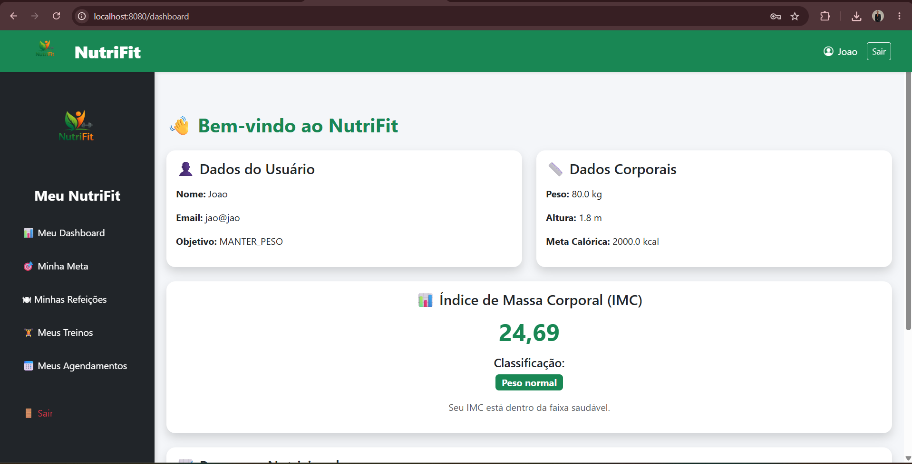
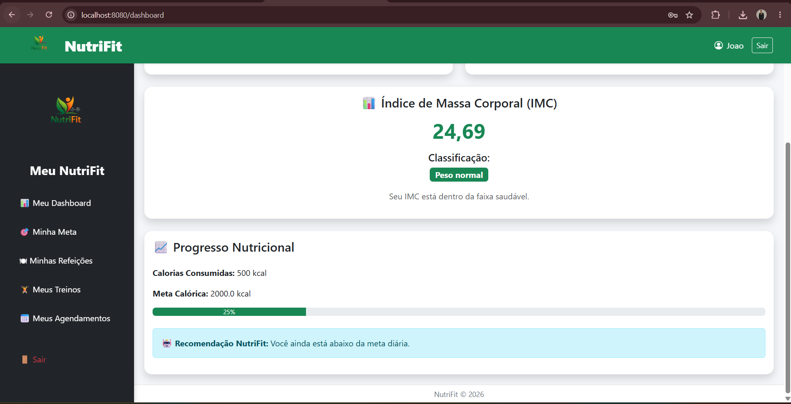

### Gestão de usuários

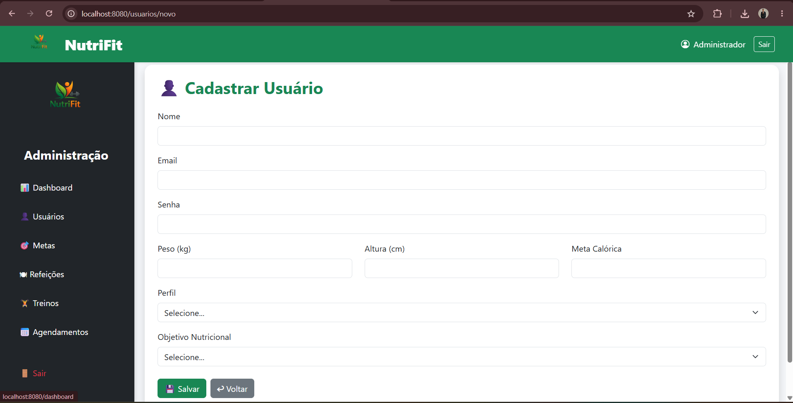

### Gestão de refeições
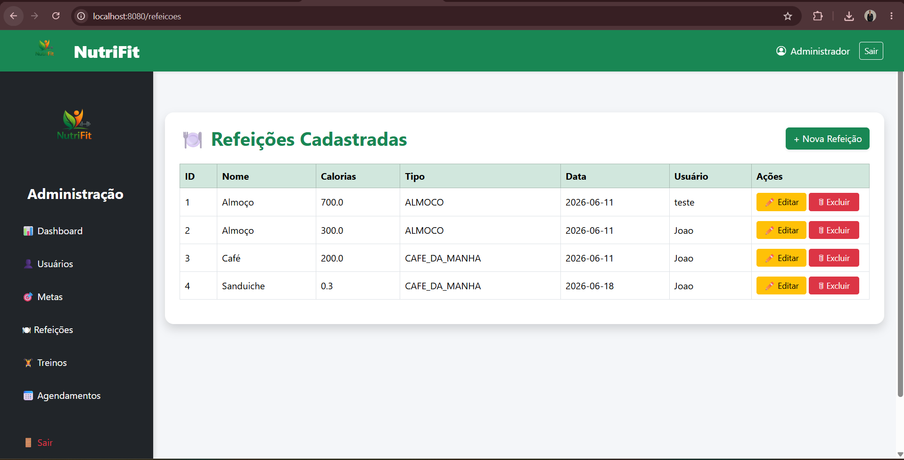
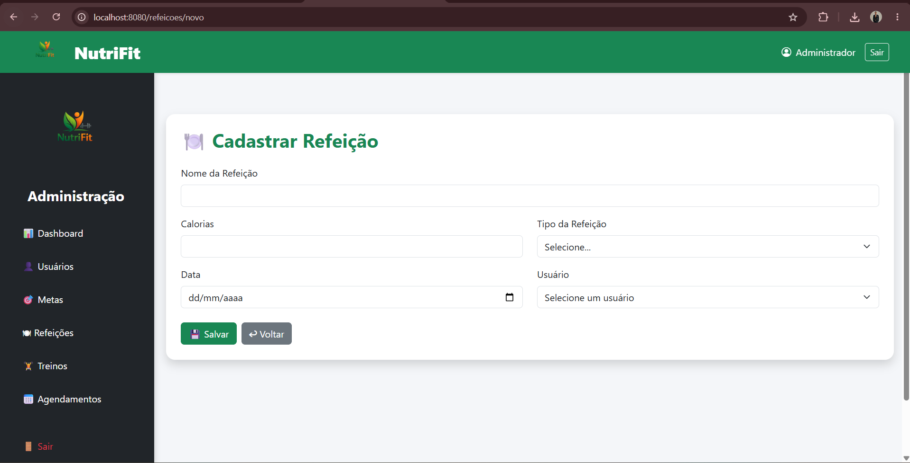
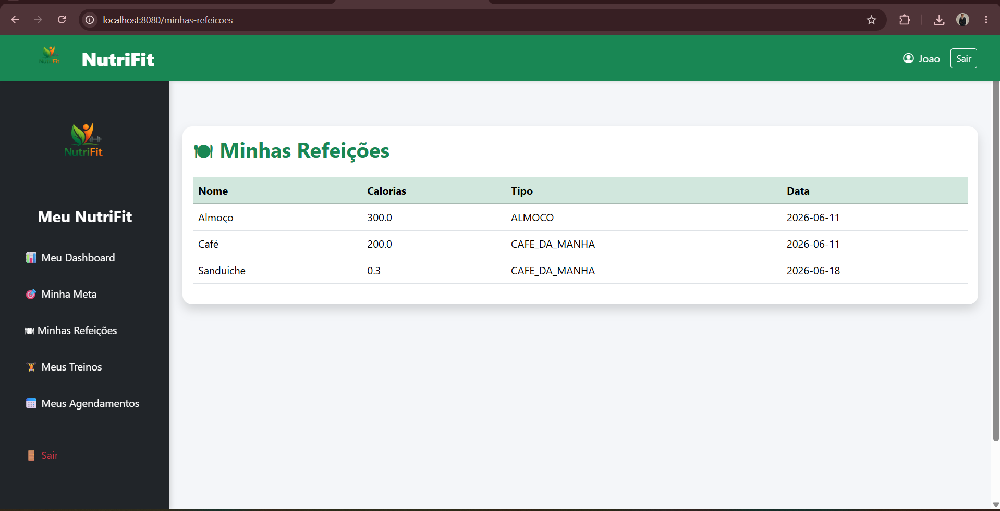

### Gestão de treinos
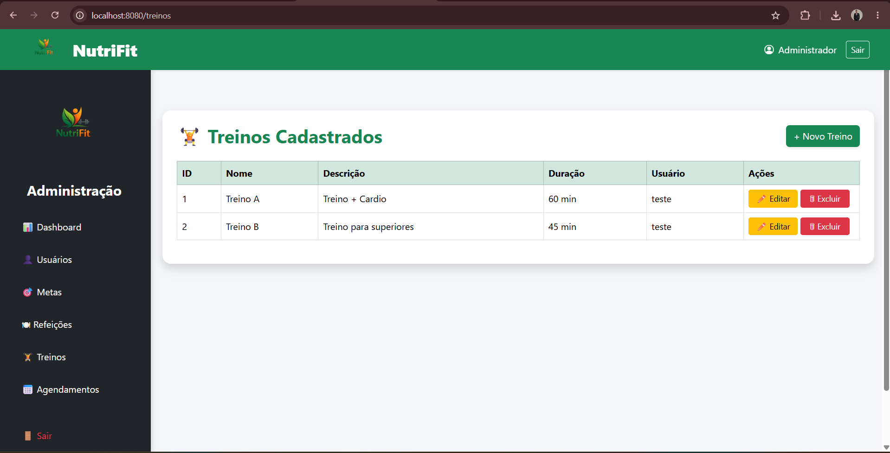
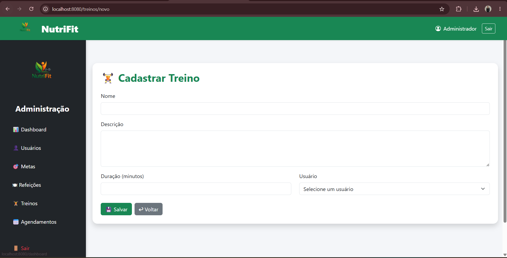
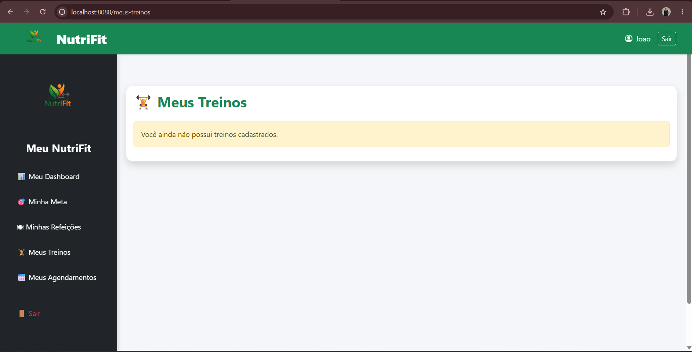

### Gestão de agendamentos
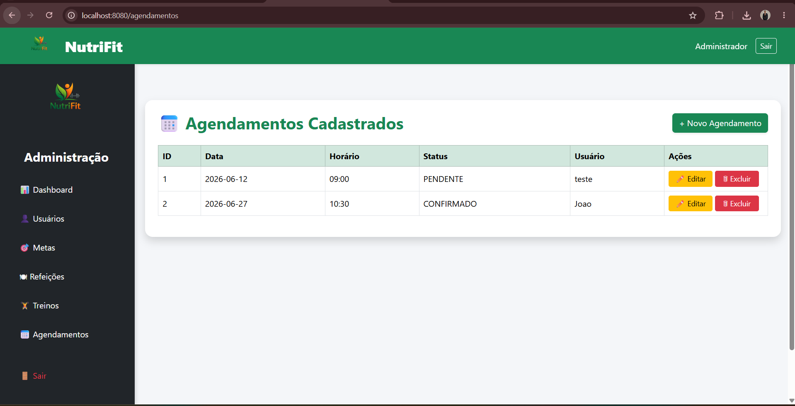
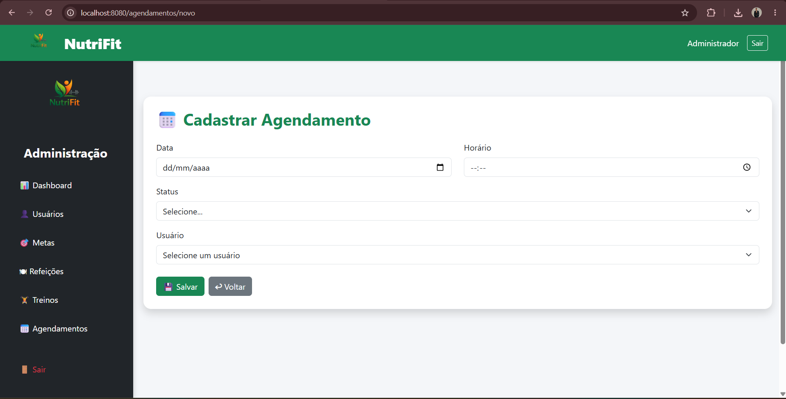
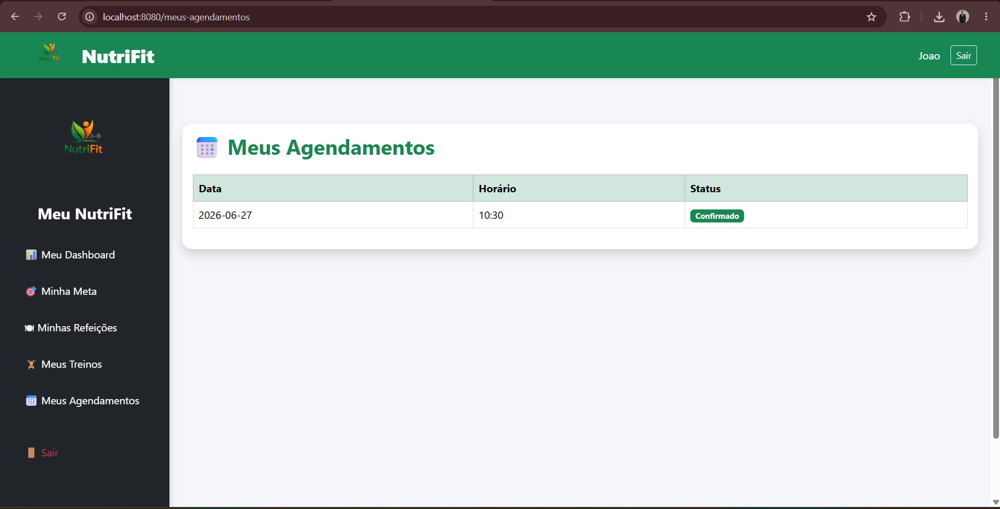

### Metas
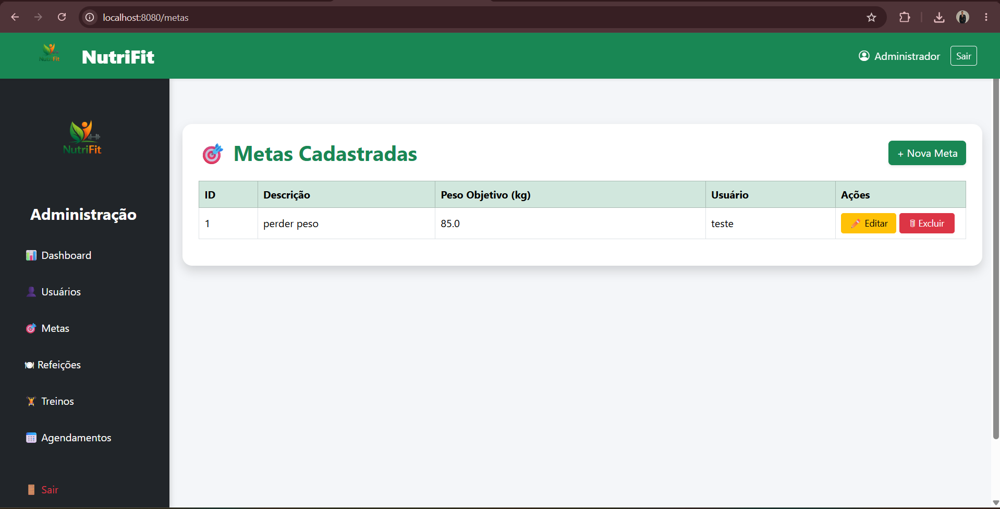
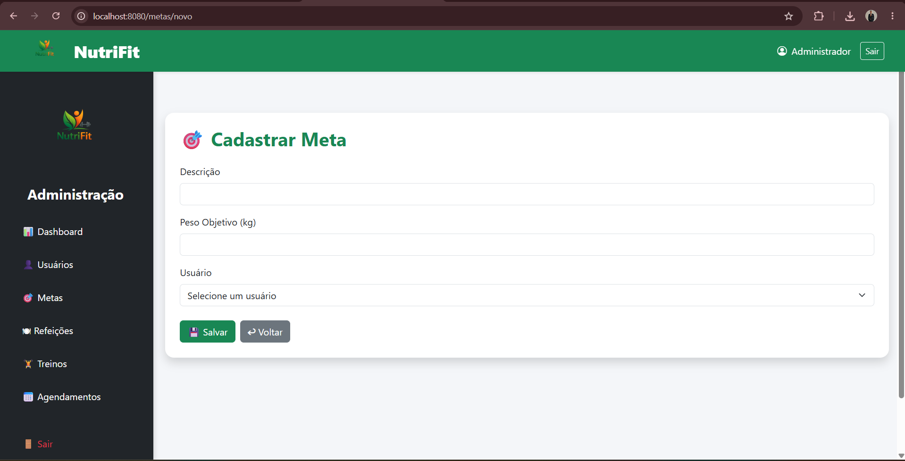
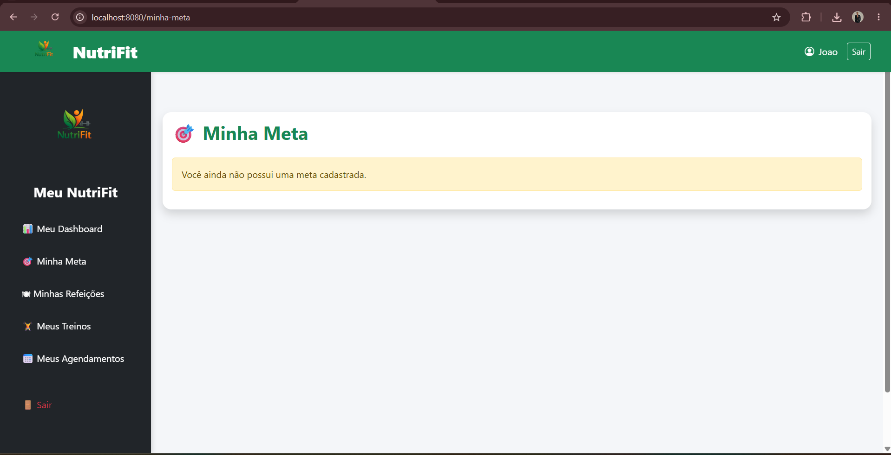